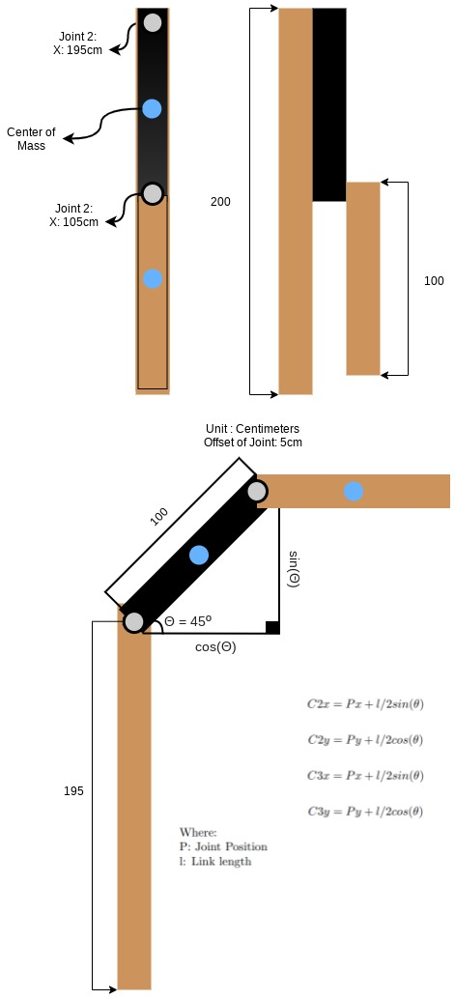

# DYNAMICS

## Langrange Formulation

**Equation for Joints:**


Where:

 : Langrangian of the robot defined as the difference between the Kinetic Energy  and Potential Energy  :


## RRBOT

Spawn Rrbot in Gazebo:
```
roslaunch rrbot_gazebo spawn.launch
```

## Potential Energy and Kinetic Energy

**Potential Energy Equation:**


**Kinetic Energy Equation were described [here](Box.md).**

Where:
+  : Mass
+  : Gravity
+  : Height

### Center of Mass Position XY of Joints - Explanation

)
Run command to monitore data:
```
rosrun rrbot_monitor dynamics_monitor.py
```
Run command to bag data:
```
rosservice call /gazebo/reset_simulation && \
rosbag record /dynamic_data --duration=30 \
  --output-name=data.bag
```
Run command to show plot:
```
rosrun rrbot_monitor bag_monitor.py
```
)


